# CryptoAnalyzer 
  ## Analysis on Bitcoin Trading History 

### Questions explored in this analysis: 
  1. Does Bitcoin's trading prices behavior more closely resemble that of a risky asset class or currency? 
  2. Is it possible to apply traditional statistical analysis used in analyzing financial security price data series to Bitcoin's trading history?
  3. How does Bitoin’s return and risk profile compare to other risky assets?  
  4. Is Bitcoin correlated with other asset classes, or is it an idiosyncratic risk factor?
  5. If Bitcoin’s daily trading history were to continue its pattern and purely price movements are a predictor of future results, what is Bitcoin’s expected forward return, and range of outcomes within a given confidence interval? 
  6. Factors that may affect investor sentiment on Bitcoin

#### 1. Does Bitcoin's trading prices behavior more closely resemble that of a risky asset class or currency? 
 
 Bitcoin's price history has been extremely volatile; in fact, the most volatile of our selected asset classes. Bitcoin's daily price movements are so volatile they are six times more volatile than the equities which are considered at the higher end of the risk spectrum of risky assets. Conversely, currencies should not necessarily appreciate over time; but most importantly, should be stable over time. currency should be a store of value and a unit of transaction with its most prized attributed being price stable over time. 
 
 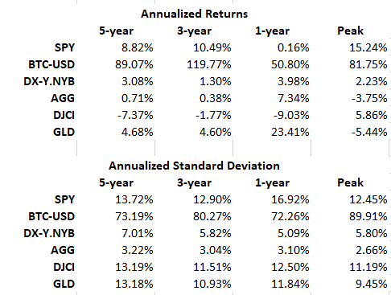

  

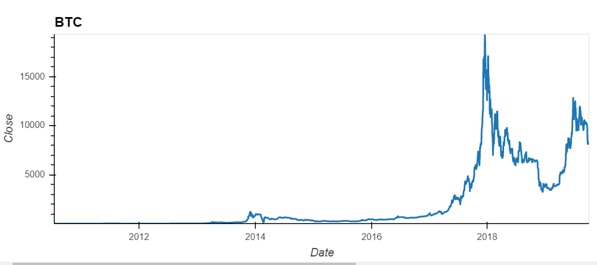
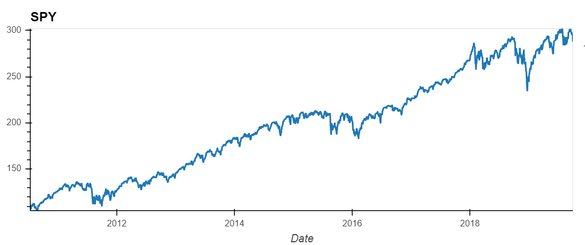
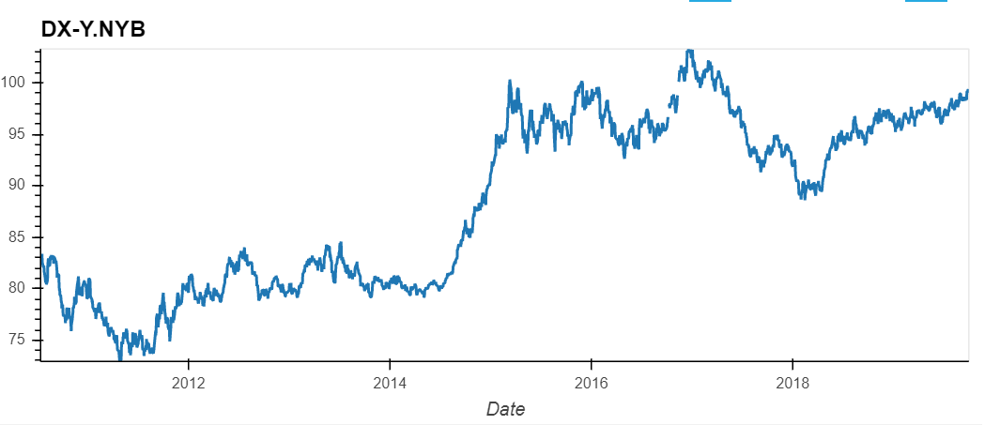

 #### 2. Is it possible to apply traditional statistical analysis used in analyzing financial security price data series to Bitcoin's trading history?
 
Observations:
In securities analysis, a normal distribution of returns is assumed and sought in order to draw conclusions with a reasonable degree of confidence. We ran a visual plot of Bitcoin's daily returns since July 2010 and compared it against the S&P500, and a highly volatile semiconductor stock, AMD. 

Conclusion:
Based on the plot visuals, we can assume Bitcoin follows a normal distribution and therefore, can be analyzed with traditional statistical analysis.
 
 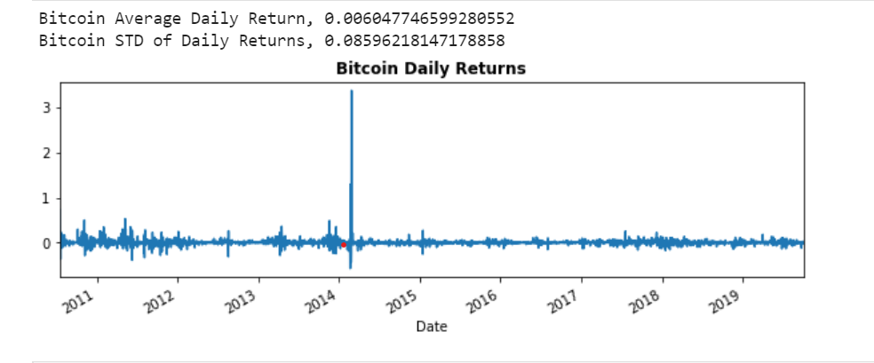
 
 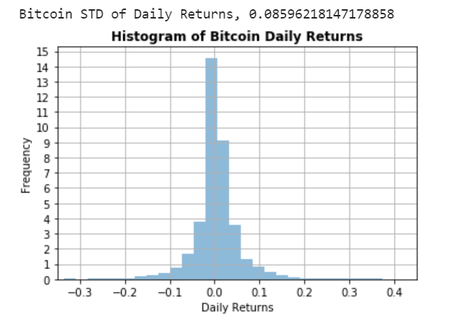
 
 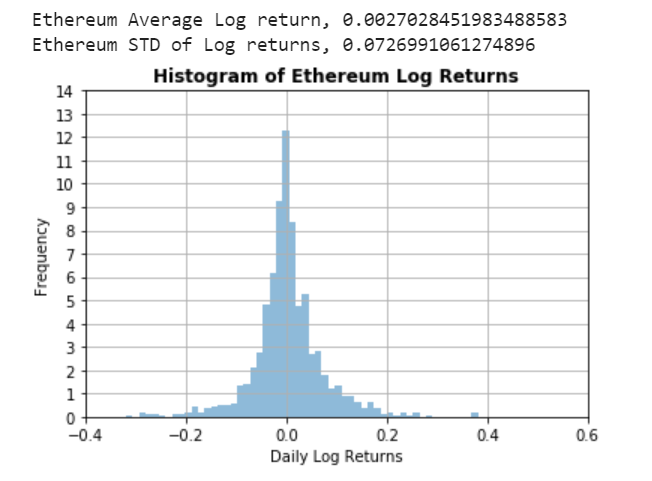
 
 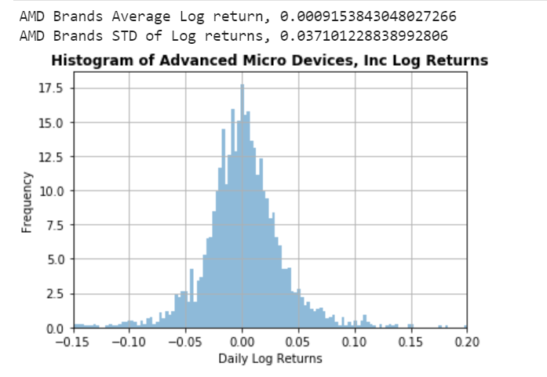
 
 #### 3. How does Bitoin’s return and risk profile compare to other risky assets?

We compared Bitcoin to the SPDR S&P 500 ETF (SPY), iShares Core U.S. Aggregate Bond ETF (AGG), US Dollar/USDX - Index, Bloomberg Commodity Index Total Return ETN (DJCI), and SPDR Gold Shares (GLD).
We looked at daily volatility and the sharpe ratios on a five year, three year, and one year return basis from 10/1/2019. We also looked at the period from 10/1/2017-10/1/2018 when Bitcoin's price had its fastest rate of appreciation and pullback in price.  

Observations:
Bitcoin’s return profile has shown superior absolute returns and risk-adjusted returns since inception and over some of our medium-term observation periods.  However – caveat emptor - as the data series had displayed a parabolic-like price appreciation in earlier years and appears to have been displaying a much different trend following its price peak. 

Conclusion:
Compared with our selected asset classes, Bitcoin has shown the best price appreciation and even risk-adjusted returns as measured by Sharpe ratio since inception and on a 3 and 5 year basis. 

However, its trend appears to be normalizing and taking on different characteristics in more recent periods.  Bitcoin still remains 58% off of its all-time high as of 10/21/2019, and displays inferior risk-adjusted results on the most recent 1-yr period compared with two of our selected asset classes. Given its extreme parabolic-like price appreciation when using earlier periods as a base, we are skeptical as to whether this dramatic outperformance can be sustainable.  

Daily volatility and sharpe ratios over the last five years

 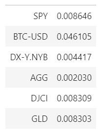

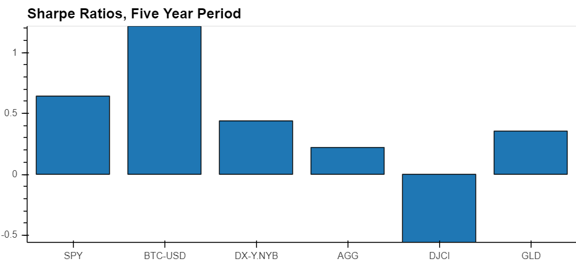

Daily volatility and sharpe ratios over the last three years

 
 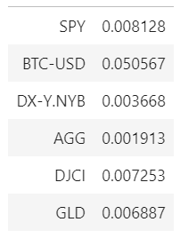
 
 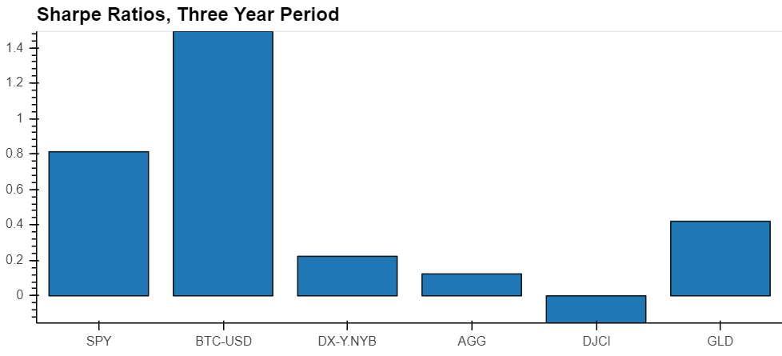

 
Daily volatility and sharpe ratios over the last year

 
 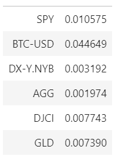
 
 
  
 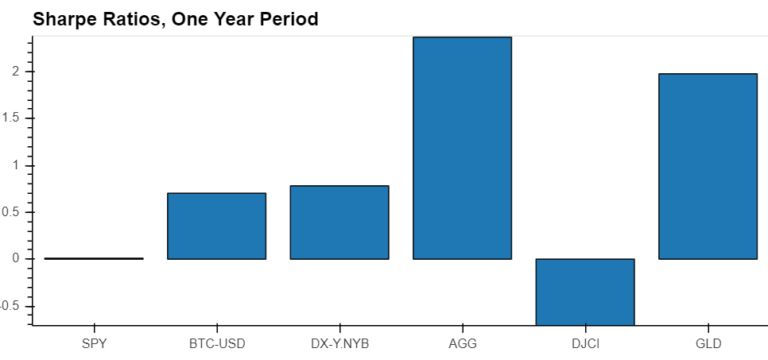

Daily volatility and sharpe ratios during Bitcoin's peak price period: 10/1/2017-10/1/2018

 
 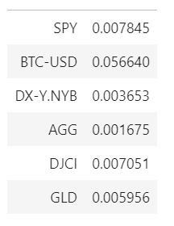
  
 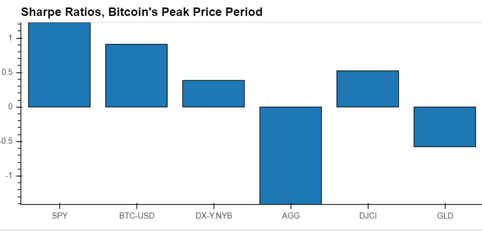
 

 #### 4. Is Bitcoin correlated with other asset classes, or is it an idiosyncratic risk factor? 
 
In terms of portfolio theory and portfolio construction, the addition of uncorrelated assets provides very valuable benefits of diversification and risk mitigation.  In fact, one of the most highly sought after and fleeting factors in alternative asset management is idiosyncratic risk.  Is bitcoin correlated with other risky assets and can it be a valuable component when included in a portfolio of risky assets?

Observations:
We ran cross asset correlations among our selected asset classes over 5, 3, and 1 year periods.  Bitcoin consistently shows very low correlations with all other asset classes.  Its correlations hover around zero with nearly all of our selected asset classes and over nearly all of our selected periods.  It certainly has the lowest correlations with all other asset classes vs. our selections.

Conclusion:
Bitcoin effectively has no discernible correlation with the range of risky assets we selected and over any of the periods we selected.  Bitcoin appears to be a unique idiosyncratic risk factor; and despite its volatility and uncertain trajectory, would likely provide diversification and hedging benefits if included in a portfolio of risky assets. 

Correlation over a 5 year period

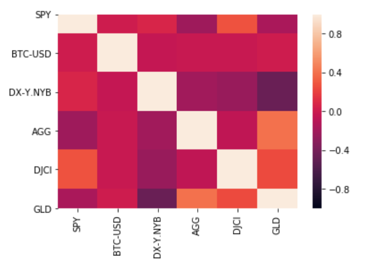

Correlation over a 3 year period

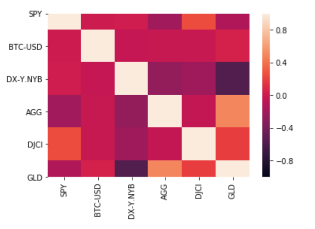

Correlation over a 1 year period

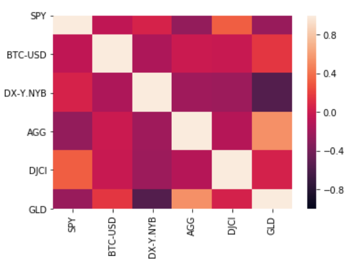

Correlation during Bitcoin's peak price period: 10/1/2017-10/1/2018 

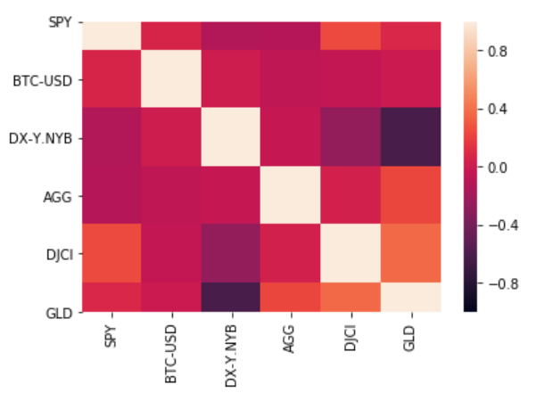

 
 #### 6. If Bitcoin’s daily trading history were to continue its pattern and purely price movements are a predictor of future results, what is Bitcoin’s expected forward return, and range of outcomes within a given confidence interval? 
 
Observations:
We ran a Monte Carlo simulation to forecast Bitcoin's price trajectory over the next 365 trading days, using Bitcoin's five year average daily returns and five year standard deviation of returns. There is a 95% chance that an initial investment of $10,000 in Bitcoin over the next 365 trading days will end within the range of $4,330.64 and $78,209.97.  This would represent a 1-yr forward return as low as negative 56% and as high as positive 682%.

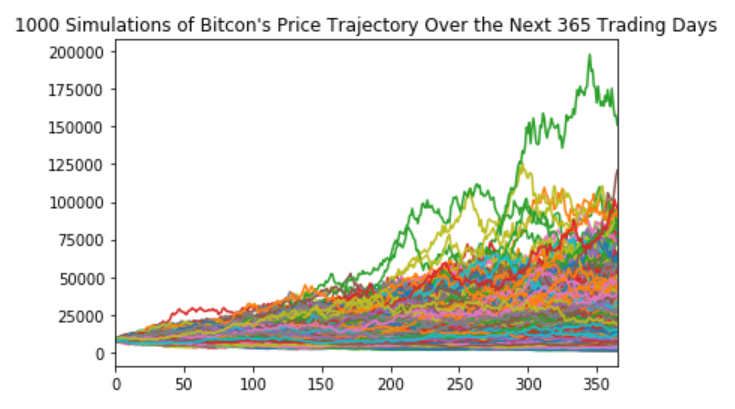

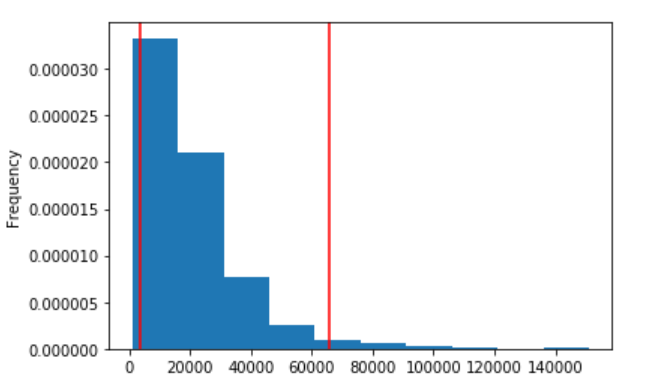

We ran a Monte Carlo simulation for a diversified portfolio with Bitcoin and without to compare a five year return trajectory. 

Given an initial investment of $20,000, in an equally weighted portfolio of Bitcoin, SPDR S&P 500 ETF (SPY), iShares Core U.S. Aggregate Bond ETF (AGG), Bloomberg Commodity Index Total Return ETN (DJCI), and SPDR Gold Shares (GLD), the expected portfolio return in dollars at the 10th percentile: $45,950.42, at the 50th percentile $58,741.36, and at the 90th percentile: $76,136.19  

Given the same initial investment of $20,000, in an equally weighted portfolio of the same assets without Bitcoin, the expected portfolio return in dollars at the 10th percentile: $38,122.49, at the 50th percentile $41,640.88, and at the 90th percentile: $45,503.43, respectively.

Conclusion:
In conclusion, Bitcoin has the potential to significantly increase in value over time. It is uncorrelated with other risky assets and provides diversification to a portfolio. And based on Monte Carlo simulations, if added to a portfolio of other risky assets, it can augment returns.  However, it has been a very volatile data series since inception and its future carries a high degree of uncertainty.

 
#### 6. Factors that may affect investor sentiment on Bitcoin

Unlike traditional currencies bitcoin is not influenced by monetary policy, inflation rates and other ecomonic metrics that would otherwise influence value of currency. The following factors do influence the bitcoin prices

  1.***Bitcoin Supply*** : It is a known fact that Bitcoin supply is capped at 21 million, once it is reached no more bitcoin will be mined. As of January 2017 80 % of the supply is already available. Once the cap is reached then it's value will be determined on how popular and attractive other cryptocurrencies will be.

 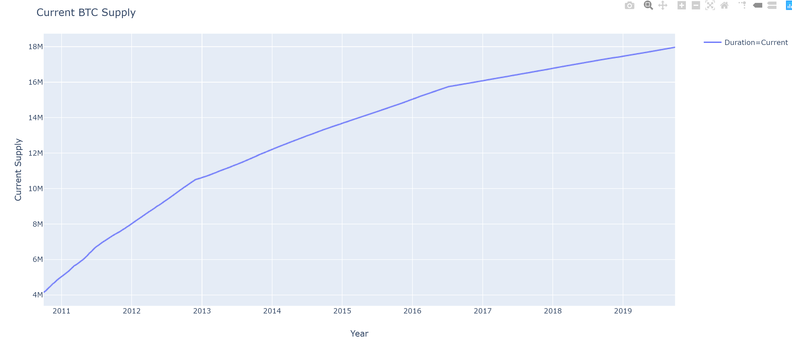
 
 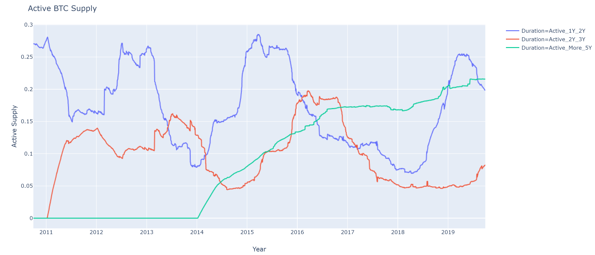

 2.***Volume***:

 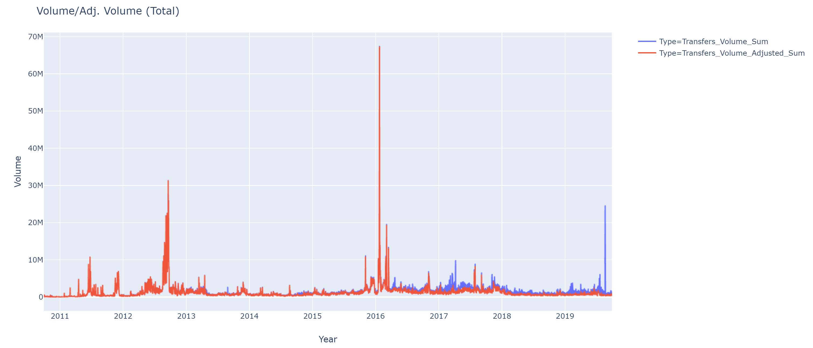

 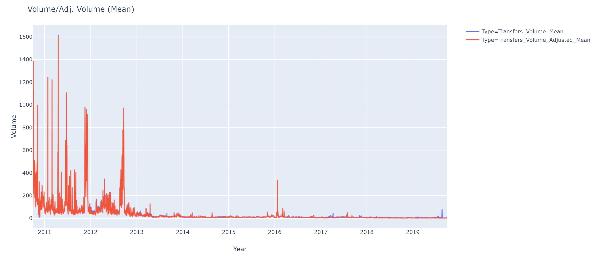

 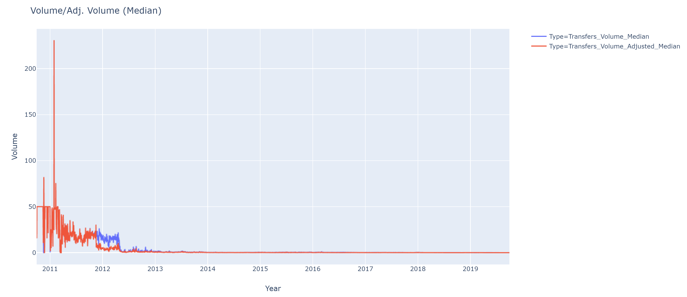

 3.***Addresses***:

 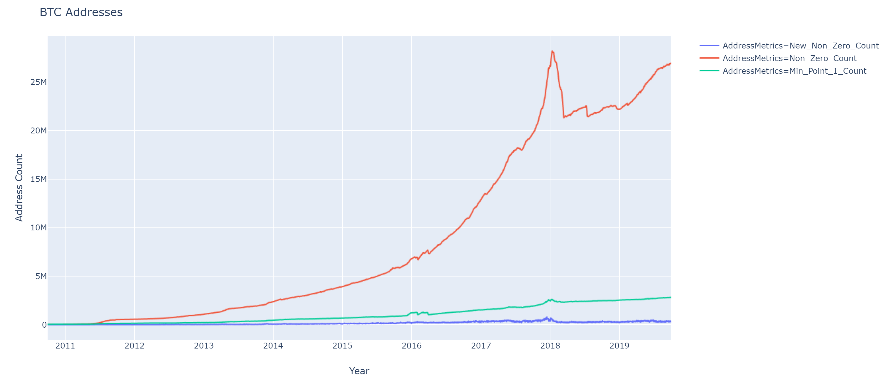

 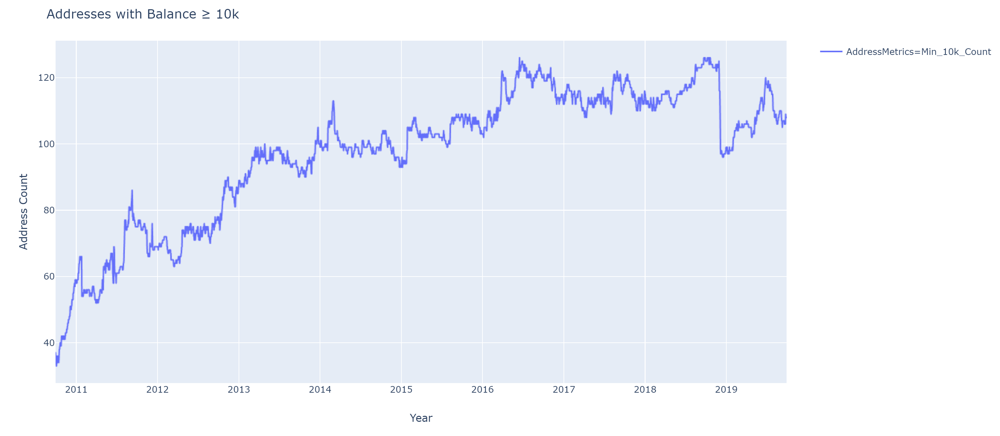

 4.***Spent Output Profit Ratio***

 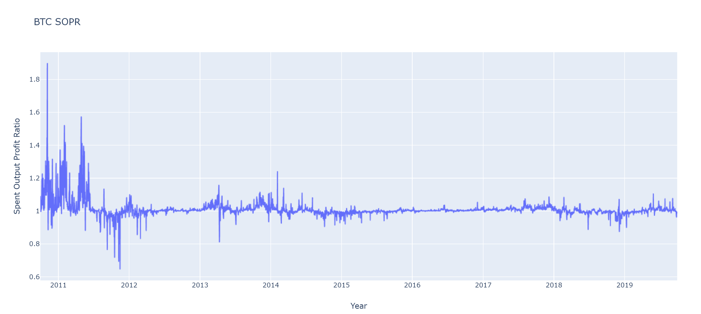

 5.***Network Value to Transactions Ratio***

 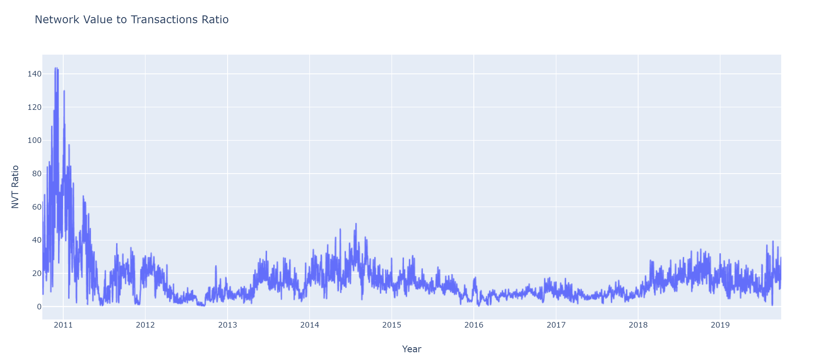

 6.***Market Cap***
 
 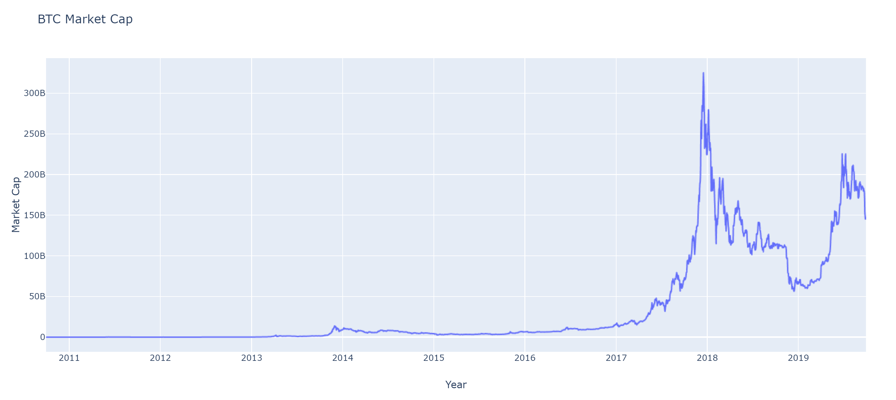

As the amount of bitcoin being awarded has decreased, the difficulty of problem has gone up hence it is becoming difficult and intensive to mine coin. There also has been a surge in transaction fees after intreset created by the media. This has aided in the cyrptocurrency as a store of value. The scalability issue has also been a pain point. The bitcoin software has a limitation of processing only 3 transactions per second. This wasn't a concern when the demand was small but this limitation will push the investors to other competitive cryptocurrencies.

